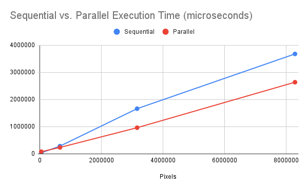

### Overview
All implementations bind the image kernels to be only 3x3. Additionally, it works only on PNGs and the output channels will be 3 (RGB), for simplicity.

You can run `make sequential` and `make parallel` to compile both files. The format is as follows:

`./build/[Sequential/Parallel]Filtering.out [image location] [box/sobel/gaussian] [sigma value if gaussian] [output file]`

Ex:

`./build/SequentialFiltering.out images/waves.png gaussian waves/computer.png`
`./build/ParallelFiltering.out images/waves.png gaussian waves/computer.png`

The image output goes to `out.png`.

Passed into each kernel are the input image, and output image, the image width, image height, a 3x3 filter. get_global_id() allows each work item to identify which pixel it should be operating on. Unsigned chars are used as the data type in accordance with stbi_image. An Image class was used to easily manipulate data with stbi_image load and writes. The code to set up communication between the host and GPU are heavily based on class examples.

### Runtime

#### Setup
- 2020 Macbook Air (M1 Chip)
- Times are collected with `chrono`. The run times include writing to the file and a little bit of argument processing logic which I attempted to make even for both algorithms.

#### Results
The sequential algorithm takes O(n) where n is the number of pixels in an image. The parallel algorithm takes roughy O(n/w) where w is the maximum number of work items. The run time of a handful of image sizes show this difference in speed. 
The 3x3 box filter was compared.

| Name      | Image dim | Seq. Run Time | Parallel Run Time |
|-----------|-----------|---------------|-------------------|
| Eng Logo  | 200x200   | 39627         | 80719             |
| Mountain  | 750x864   | 285053        | 235842            |
| Ventricle | 2048x1542 | 1663134       | 963041            |
| Waves     | 3840x2160 | 3678608       | 2638071           |

As you can see, the OpenCL algorithm terminates much faster with a sufficiently large image. It runs slower than the sequential algorithm for image size 200x200, suggesting the overhead of using OpenCL for an image of this size is too large. However, as seen with larger image sizes, the parallel algorithm scales much slower with image size after images are larger than roughly 60000 pixels.

### Note
Running this recently, I noticed there's no notable performance benefit for images smaller than Waves as there was too much variation in the runtime. You can also run `make sequential_opt` and `make parallel_opt` to see the impact of `-O1` on both programs (there are also some OpenCL-specific Clang flags I should test).

### Sources
From Andrew Diggs in PHY 250 at UCD:
- ErrorLogging.h
stb_image & stb_image_write: https://github.com/nothings/stb/

The images (in order):
- The UCD Engineering Logo (https://www.linkedin.com/company/university-of-california-davis-college-of-engineering/)
- Mountain from Vecteezy.com (https://www.vecteezy.com/free-photos)
- Ventricle II by Savanna Jude (https://heartslob.com/)
- Waves (https://4.bp.blogspot.com/-KBLDnQ90g4g/UmvW7pjV5xI/AAAAAAAASlE/iMEPAmWJ5FM/s0/Rolling_Waves_Mod-ultra-HD.jpg)
